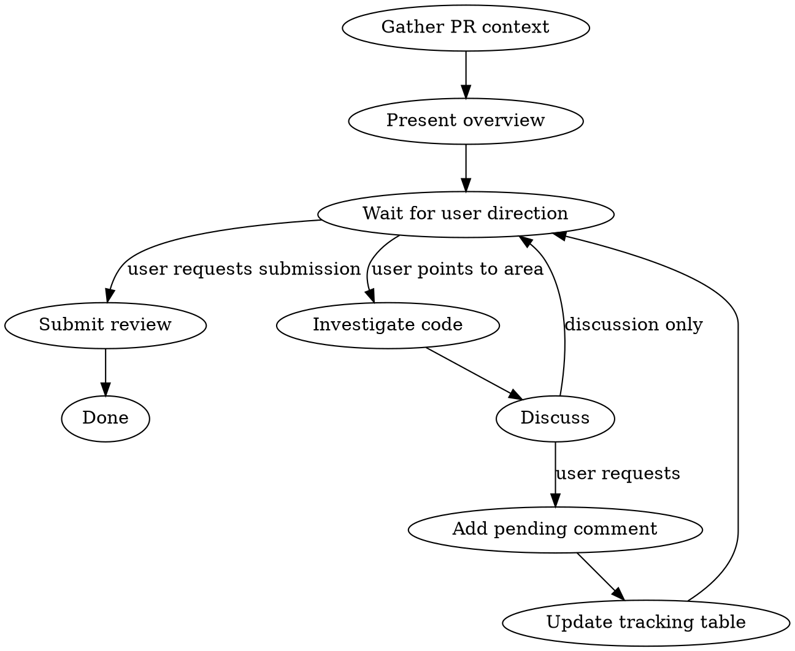

# Collaborative PR Review

## Overview

User-driven interactive PR review. User points to code areas, Claude investigates and discusses, pending comments are added only when explicitly requested. Review is submitted with a dependency graph showing relationships between comments.

## Workflow



## Phase 1: Setup

1. Find PR for current branch: `gh pr list --head <branch>`
2. Fetch context in parallel:
   - `git log <base>..HEAD --oneline` — commit list
   - `git diff <base>...HEAD --stat` — change stats
   - `git diff <base>...HEAD --name-only` — changed files
3. **Sync existing review state**:
   - Check for existing pending review: `gh api graphql` — query `reviews(states: PENDING)`
   - If exists: fetch its comments (`reviews/{id}/comments`) and populate the tracking table
   - If not: a new pending review will be created when the first comment is added
4. Present a concise overview table (package / area / summary)
5. If existing comments found, show them in the tracking table before starting
6. Ask user where to start

## Phase 2: Interactive Review Loop

### When user points to code

1. **Investigate first** — read the code, trace call sites, check cross-platform (react/rn) counterparts
2. **Discuss** — answer questions, raise concerns, propose alternatives
3. **Never add comments unprompted** — wait for explicit "pending comment" request

### When adding pending comments

1. Find the existing pending review via GraphQL:
   ```
   gh api graphql — query for PENDING review on the PR
   ```
2. Add comment thread to the pending review:
   ```
   mutation { addPullRequestReviewThread(input: {
     pullRequestReviewId, path, line, startLine, side: RIGHT, body
   }) }
   ```
3. Update the running tracking table and show it to the user

### Tracking table format

Maintain a running table after each comment addition:

```
| # | 파일 | 요약 |
|---|------|------|
| 1 | `file.ts:L5-10` | one-line summary |
```

## Phase 3: Review Depth Guide

Investigate at these levels, going deeper as discussion warrants:

| Level | What to check |
|-------|--------------|
| **Naming** | Convention consistency, intent clarity |
| **Structure** | File placement, component vs context, responsibility separation |
| **API design** | Hook signatures, parameter count, callback patterns |
| **Cross-platform** | React/RN parity, shared code in core |
| **Architecture** | Props drilling vs context, provider hierarchy, data flow |
| **Performance** | Unnecessary re-renders, object creation, cleanup |
| **Correctness** | Race conditions, edge cases, dedup, streaming behavior |

### Comment quality

- Reference specific file paths and line numbers
- Explain the problem AND suggest a direction
- When proposing API changes, show concrete code snippets
- Runtime behavior (timing, ordering, race conditions) is described with concrete step-by-step execution traces, not abstract descriptions
- Note when the same issue applies to other packages (react/rn)
- Distinguish severity: structural concern vs nit

## Phase 4: Submission

### 1. Analyze comment relationships

Group comments by theme and map dependencies:
- Which comments enable other comments?
- Which comments supersede others?
- Which are standalone?

### 2. Build dependency graph

```
┌─────────────────────────────┐
│  Group A: Theme name         │
│  #N root comment             │
│   ├── #M depends on #N       │
│   └── #K depends on #N       │
└─────────────────────────────┘
```

### 3. Recommend work order

Number groups by dependency order. Note which groups can be parallelized.

### 4. Submit via GraphQL

```
mutation { submitPullRequestReview(input: {
  pullRequestReviewId, event: COMMENT, body: "## Review Summary\n..."
}) }
```

## Key Rules

- **User drives** — Claude investigates and discusses, never dictates focus
- **No unprompted comments** — only add when user explicitly requests
- **Investigate before opining** — always read code first, trace the full picture
- **Track everything** — show updated table after each comment
- **Cross-platform awareness** — when reviewing react, check rn counterpart and vice versa
- **Discussion ≠ comment** — some discussions conclude without a comment, and that's fine
